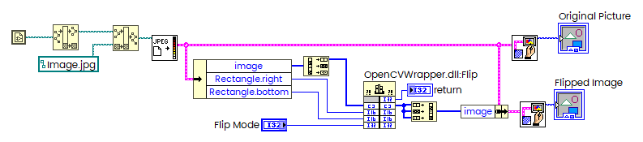
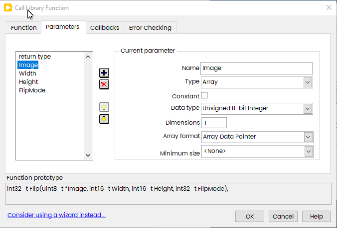
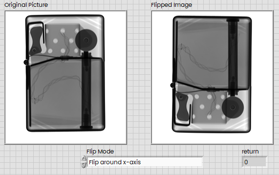

# OpenCVFlipDemoLV

Very simple basic Wrapper for OpenCV.

```c
#include "opencv2\opencv.hpp"

using namespace cv;

extern "C" __declspec(dllexport) int Flip(void *img, short Width, short Height, int FlipMode)
{
	try{
		Mat Image(Size(Width, Height), CV_8U, img, Width);
		flip(Image, Image, FlipMode);
	}
	catch (Exception e){
		const char* err_msg = e.what();
		return 1; //OpenCV Error occurred
	}
	return 0;
}
```

LabVIEW Code



DLL call:



Result:



The DLL was compiled using Microsoft Build tools with VSCode. 

Refer to [Configure VS Code for Microsoft C++] (https://code.visualstudio.com/docs/cpp/config-msvc)

